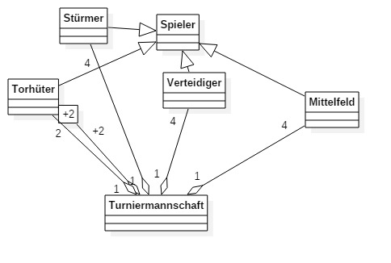

# Collections (in C#)

|Aktion|Array|List|
|---|---|---|
|Erstellen| `string[] texts = new string[10]`|`List<string>texts = new List<string>();`
|Zuweisen|`texts[0] = "foobar";`|`texts.Add("foobar");`
|Zugriff|`Console.Write(texts[0])`|`Console.Write(texts[0])`|
|Weiteres|statische Methoden von System.Array|Methoden an List-Objekten aufrufen (Instanzmethoden)

# Klassendiagramme
## Aufgabe 1

## Aufgabe 2

