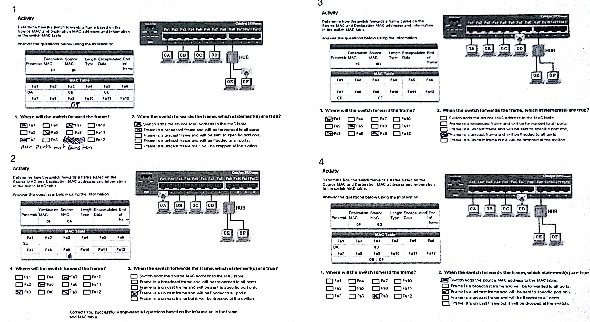

# Switches und Hubs - Ein Vergleich
###### Broadcast
im Frame eine Broadcastadresse  
ausgehend vom Client "an alle"
###### Flooding
im Frame eine Unicast adresse angegeben  
ausgehend vom Switch "an alle"

#### Routing Activity
> Klassenarbeit wird ähnliche Aufgaben enthalten (wahrscheinlich 4)  

##### Blatt 1

##### Blatt 2

#### DHCP Client Anfrage

|Ziel MAC|Quell MAC|Ziel IP|Quell IP|
|:---:|:---:|:---:|:---:|
|FF|HostA|255....|0.0.0.0.|

### VLANs
einteilung eines physikalischen Netzes in mehrere logische Netze  
bildet eigene Broadcast Domain  
Kommunikation zwischen zwei VLANs nur über Router möglich  

#### Aufgabenblatt zu VLANs
1. 3 Merkmale / Möglichkeiten von VLANs
 - portbasiertes VLAN
 - tagged VLAN
 - eigene Broadcast Domain  
    - Broadcast Nachrichten werde nur innerhalb des VLANs weitergeleitet
 - einteilung in logische Netzwerke von physikalischen Netzen
 - flexibel
 - Lastverteilung
    - höhere Bandbreitennutzung
 - Gruppenzugehörigkeit
 - autarke Haltung von Netzen schränkt Malware Bedrohung ein
 - logische Gruppen innerhalb physikalischer Topologie
2. statische VLANs
 - synonym für portbasiertes VLAN
 - jedes Gerät an einem bestimmten Port wird Teil des VLAN
3. dynamische VLANs
 - bspw. MAC basiert
 - Protokolle IP, TCP/IP 
 - egal an welchem Port, wird das Gerät basierend auf seiner MAC Adresse dem passenden VLAN zugeordnet
4. siehe [Material](Material/2017_03_07_Aufgabenblatt_1.pdf) -> [Lösung](Material/2017_03_07_Solution.pdf)
 > Klausurrelevant
