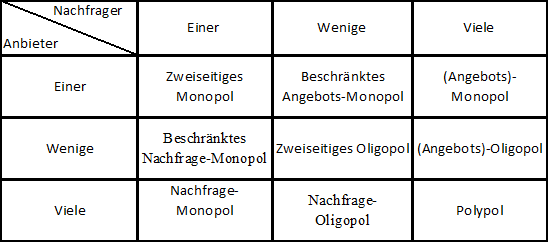

### Wirtschaft
##### Skonto
wird vom Endbetrag, nach allen Rabatten, abgezogen
##### Gewinnzuschlag
berechnet sich aus den Selbstkosten
##### Angebot und Nachfrage

##### Logische Verknüpfungen
**\>=1** OR  
**=1** XOR  
**&** AND  
