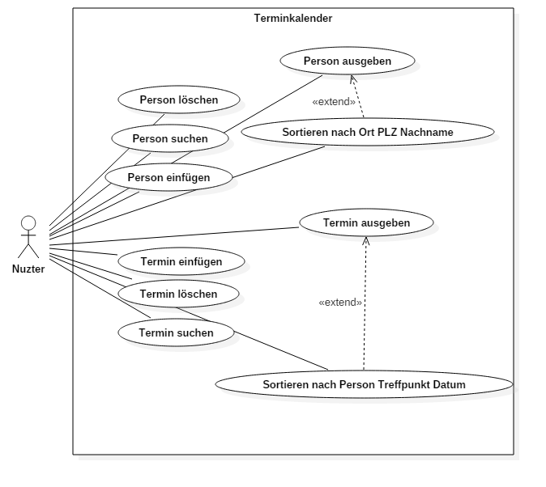
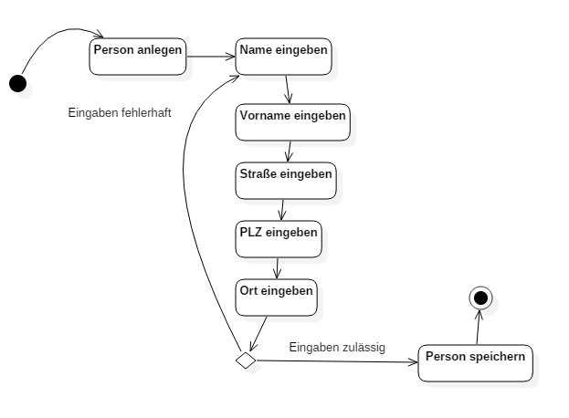
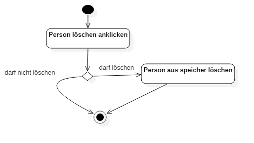
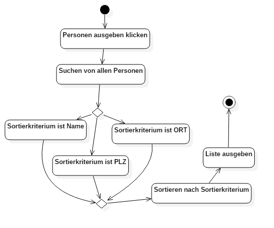
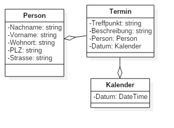

# DV Konzept

## Vorgaben
- Klasse Person
  - Nachname
  - Vorname
  - Wohnort
  - PLZ
  - Straße + Hausnummer
- Liste mit Personen, beliebig groß
- Personen einfügen, löschen, suchen, Ausgeben
- alle Personen sortiert nach Kriterien
  - Nachname, PLZ, Ort
- Klasse Termin
  - Person  
  - Termin (aus Klasse Kalender)
  - Treffpunkt
  - Beschreibung
- Liste Termine, beliebig lang
- Termine einfügen, löschen, suchen, Ausgeben
- alle Termine sortiert nach
  - Nachname
  - Treffpunkt
  - Datum

## Use Case

## Aktivitäten

## Sequenzen
> müssen wir nicht.

## Klassen

