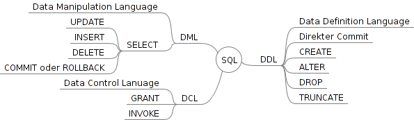

# Transaktionsmanagement

# ACID
### Bisherige Annahmen
- Isolation  
  - Nur ein Anwender
- Atomizität
  - eine einzige Operation, keine Teilschritte

###### Transkation
eine Folge von Operationen die die DB von einem konsisten Zustand in einen anderen konsisten Zustand überführt.

#### Atomicity / Atomarität  
Transkation wird entweder ganz oder gar nicht
#### Consistency / Konsistenz  
DB vor und nach der Transkation in einem konsisten Zustand
#### Isolation / Isolation  
Transkation "denkt", dass sie ganz allein auf der DB arbeitet
#### Durability / Dauerhaftigkeit  
Nach Abschluss der Transkation ist das Ergebnis dauerhaft.
### Probleme die ACID löst
#### Abhängigkeit von nicht freigegebenen Daten
Dirty Read
#### Inkonsistentes Lesen
Norepeatable Read
#### Berechnungen auf unvollständigen Daten
Phantom-Problem
#### Verlorengegangene Änderungen
Lost Update

### Klausur
nur SELECT!  
aber alle Themen dazu
