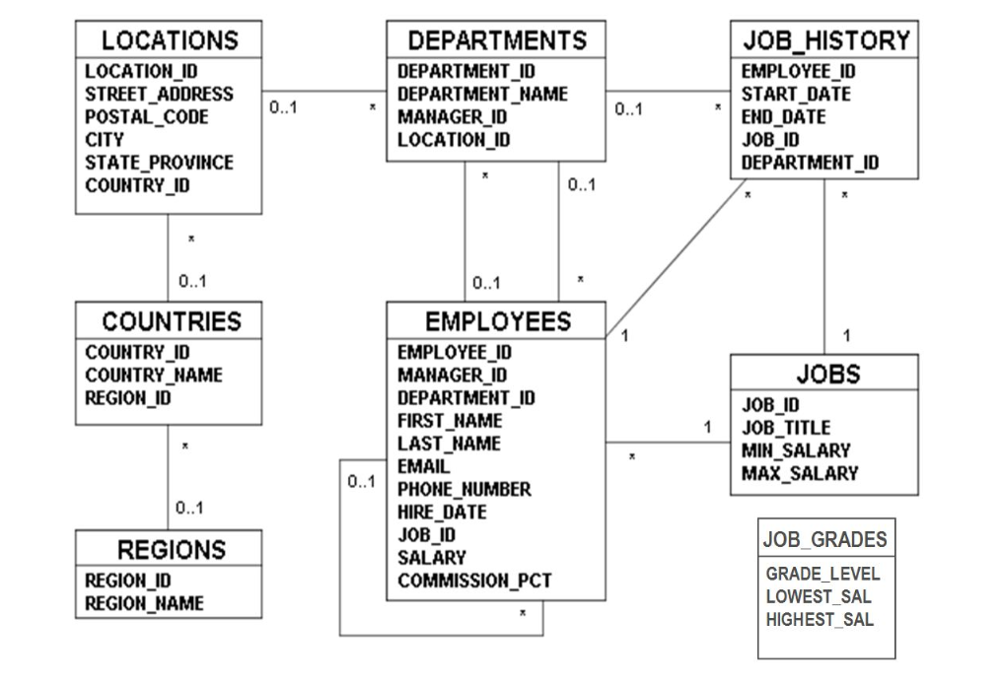

### SQL
- DDL
 - CREATE DROP TRUNCATE
- DML
 - SELECT DELETE
- DCL
 - Nutzerverwaltung, Rechte  

##### Transaktionen

##### ACID

## Aufgaben
Berechtigungskonzept erstellen für folgende Grafik

### Oracle DB User Rights
