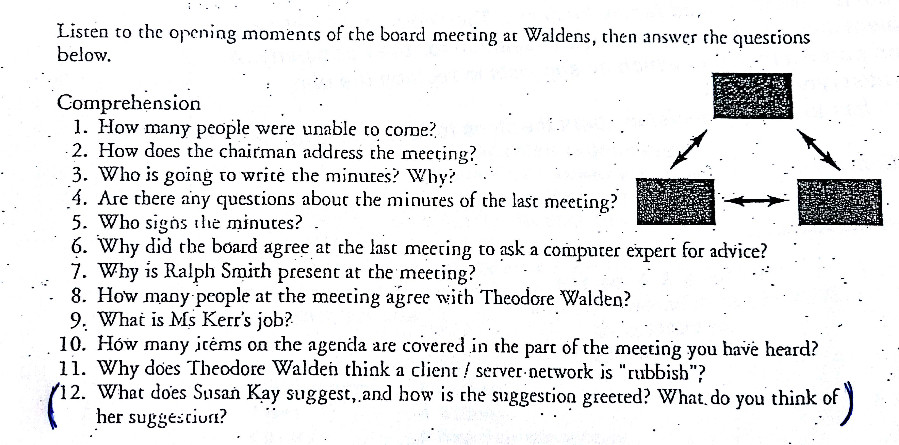

# Walden & Sons
## Listening Comprehension

1. Two directors are missing due to holidays and the minutewriter is sick
2. Good afternoon, could I have your attention please?
3. Petra, because the normal minutewriter Joe Nowks is sick and was appointed
4. no questions
5. William, the chairman
6. they feel unqualified regarding decisions about computer situation
7. wrote a report on computer systems, is the expert
8. no one
9. personell director
10. Item 1 & 2
11. he doesn't understand what a client is, is stupid and afraid of technology

---

## Reading Comprehension

1. A complete client/server network system
2. Java language to run network applications
3. Ms Ann Walden
4. Entering master data from bookkeeping ledgers into database of accounting program
5. No, Temporary Staff will be employed
6. Mr. Theodore Walden will resign at the end of the quarter
7. Yes, they have to be handed in by July 20th, the meeting is on July 23rd
8. They meet quarterly
