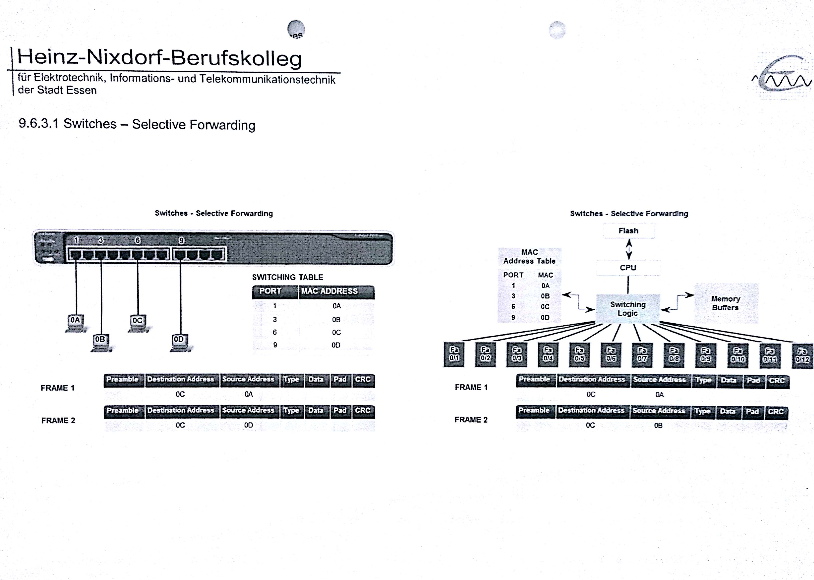

### Lehrerwechsel
Bergmann
## Framing
passiert Osi Schicht 2  
## Kollisionen und Kollisionsdomänen

##### Aufgabe 1
Welche Hosts empfangen gesendete Frames?  
`EVERYONE!!`
##### Aufgabe 2
Was ist eine Kollsion in einem Netzwerk?  
`Zwei Host versuchen gleichzeitig zu senden`
##### Aufgabe 3
Was ist eine Kollisionsdomäne?  
`physikalisch angeschlossene Netzwerke in denen Kollision auftreten können`
##### Aufgabe 4
Warum sind Kollsionen schlecht?  
`bei einer Kollision wird das Netzwerk gestoppt und erst nachdem alle Hosts von der Kollsion erfahren haben wieder gestartet`

## Switches

