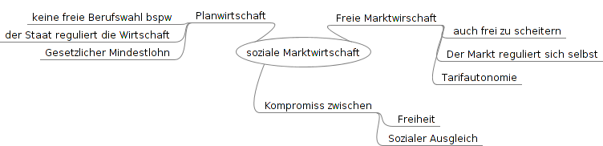

## Der Tarifvertrag
##### Tarifpartner
Gewerkschaften -> Arbeitgeber  
Gewerkschaften -> Arbeitgeberverbände  

##### Tarifautonomie
Die Tarifpartner haben das Recht eigenständig ohne staatlichen Eingriff Tarifveträge abzuschließen/zu verhandeln.  
##### Soziale Marktwirtschaft  

