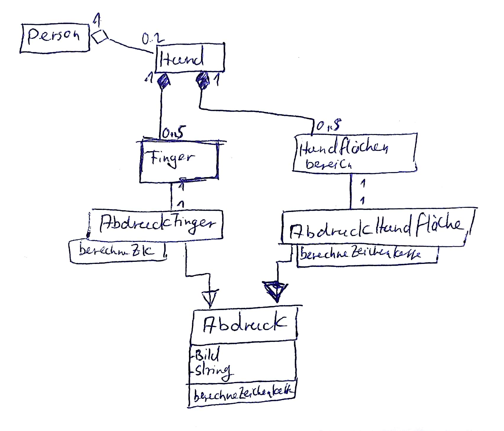

## Themen
- Scan, Scim, Read
- Web Design
    - responsive
- 1 Algorithmusaufgabe

## Übung Algorithmusaufgabe
[Aufgabe](./Material/20180314_Fingerabdruck.pdf)  
##### 1. Handlungsschritt

##### 2. Handlungsschritt
```csharp
private Match[] auswertung(string abdruck, int schwelle, int finger)
{
    Match[] suchergebnis = suche(abdruck);
    for (int i = 0;i<laenge(suchergebnis);i++)
    {
        if(suchergebnis[i].score<schwelle)
        {
            loesche(suchergebnis,i);
        }
        if(finger>0)
        {
            if(suchergebnis[i].idFinger != finger)
            {
                loesche(suchergebnis,i);
            }
        }
    }
    //TODO: Bubblesort
    return suchergebnis;
}

```
