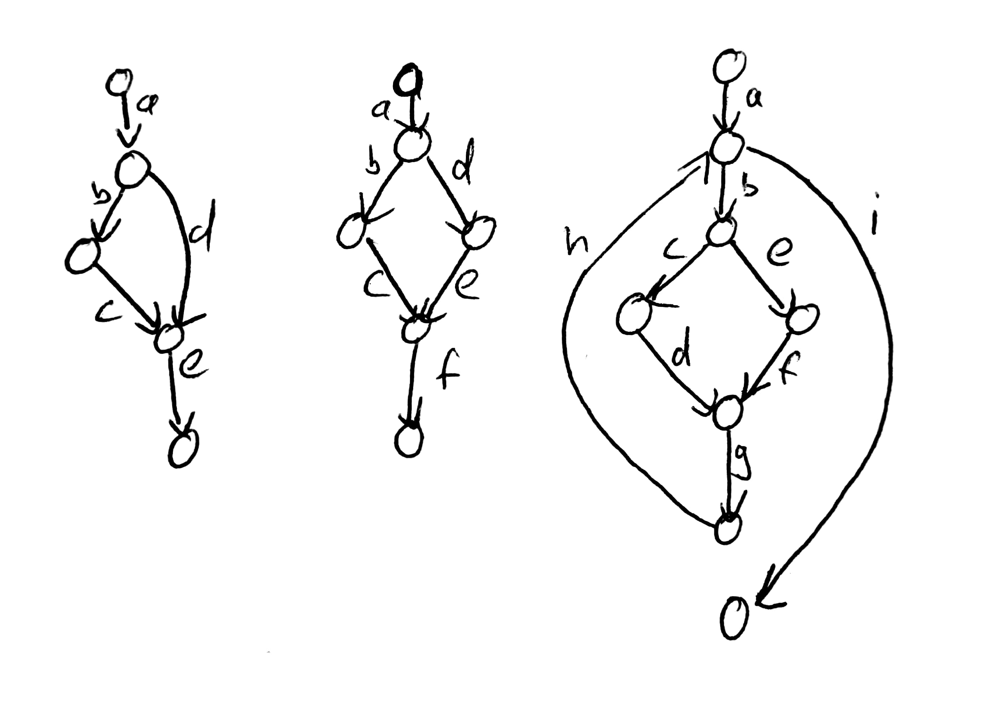

## Klausurthemen

- Testing
  - Grundbegriffe
    - [Wiki](https://moodle-hnbk.de/mod/wiki/view.php?wid=15&title=Softwaretesting&group=0)
  - Dynamische Testverfahren
    - Voraussetzung: lauffähiges Programm
    - Testfallentwurfsverfahren
    - Black Box Verfahren
    - Äquivalenzklasenverfahren
    - Grenzwertverfahren
    - Überdeckung berechnen


### Bsp Überdeckung

```
Anzahl getesteter ÄK
------
Anzahl ÄK
```
```
Anzahl getesteter GW
------
Anzahl GW
```
    

## Aufgaben
[Aufgabenstellung](Material/20171010_Aufgabe_AEKL_GW.txt)  
[Tabelle](Material/20171010_Uebung_AEKL_GW.ods)

# Dynamische Testverfahren mit Quellcode (Whitebox Testing)
Ziel ist so viel Quellcode wie möglich abzudecken.  
Mit Hilfsmitteln, Kontrollflussgraph  
Bsp. Cryption Funktion  

##### Kontrollflussgraph: 
Kontrollstrukturen mithilfe von Knoten und Kanten darstellen  
Sequenzen in einem Knoten zusammenfassen.

##### Whiteboxverfahren
Beispiel Kontrollflussgraphen




##### C0 Anweisungsüberdeckung

- BSP1: TF1  `A B C E`
- BSP2: TF1  `A B C F`
- BSP2: TF2  `A D E F`
- BSP3: TF1  `A B C D G H I`
- BSP3: TF2  `A B E F G H I`
- BSP3: TF3  `A B C F G H B E F G H I`

##### C1 Zweigüberdeckung 
(=Kanten bzw Pfeile im Kontrollflussgraph)   
= Entscheidungsüberdeckung  

- BSP1: TF1, TF2 = `A D E`  
- BSP2: TF1 und TF 2  
- BSP3: Wie C0  

Aber C0 != C1, C1 -> C0


##### C(unendlich) = Pfadüberdeckung
= alle möglichen Wege/Pfade durch den Kontrollflussgraphen  
=> vollständiger Test in der Regel nicht möglich

##### Kompromisslösung: 
Cn Test, n>1  
n=3  
=> 0 - 3 mal wiederholen -> hierbei alle möglichen Pfade.