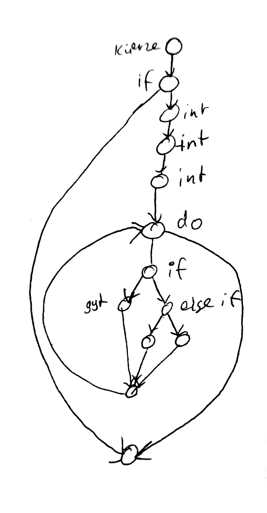
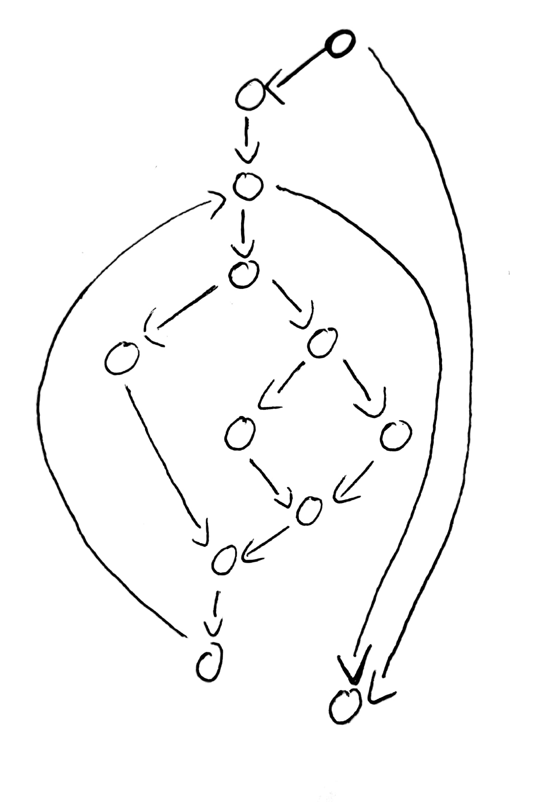

nächste Woche, Test Whitebox Testverfahren.

## Zu testender code
```csharp
void kuerze(){
    if (zaehler!=0){
        int ggt =0;
        int az = Math.Abs(zaehler);
        int an = Math.Abs(nenner);
        do{
            if(az == an)
                ggt = az;
            else
                if(az > an)
                    az -= an;
                else
                    an -=az;

        }while(ggt==0);
        zaehler /= ggt;
        nenner /= ggt;
    }
}
```
{width=300px}
{width=300px}