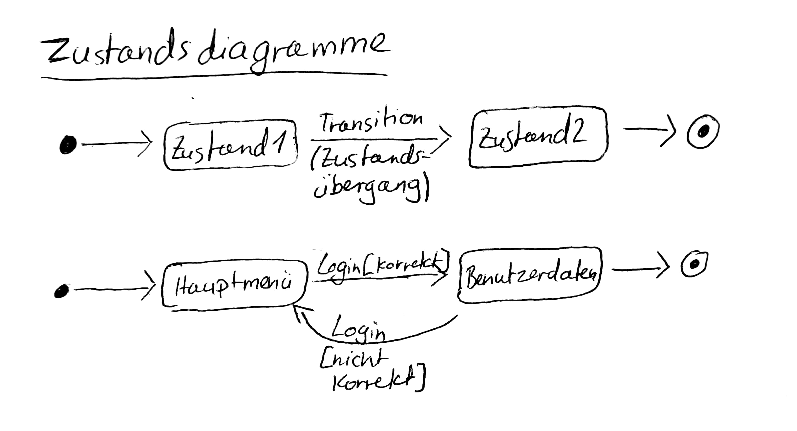
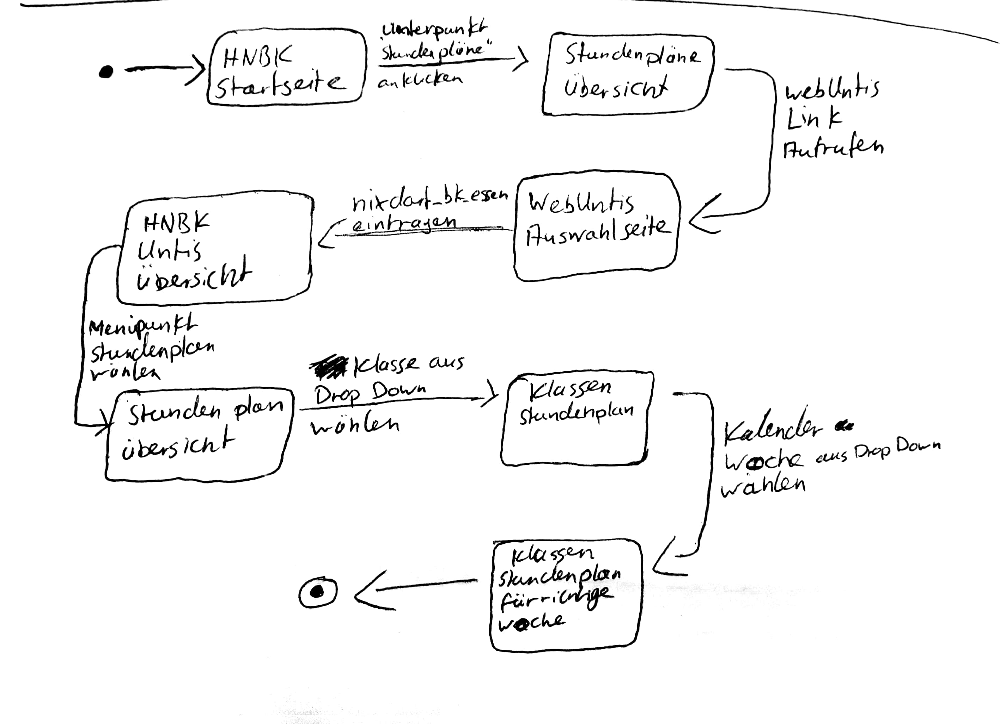

# UML Zustandsdiagramme
#### Ziel
Darstellung aller möglichen Zustände und Zustandübergänge von Automaten, Programmoberflächen, ...  
> Basis zum Testen -> Zustandsbaum  

Bsp. Zustandsdiagramm


# Übungen
[Übung Zustandsdiagramme](./Material/2017_10_17_UBZustandsdiagramme.pdf)
### Aufgabe 1


## Zustandsbaum
Bsp. HNBK Homepage


# Teil 2
## Code Beispiel 
```csharp
public void Kuerze() {
    // größten gemeinsamen Teiler mit dem Euklidischen Algorithmus bestimmen
    if (zaehler != 0) {
    int ggt = 0;
    int az = Math.Abs(zaehler);
    int an = Math.Abs(nenner);
    do {
    if (az == an)
      ggt = az;
    else  
      if (az > an)  
       az = az ‐ an;
      else
       an = an ‐ az;
    } while (ggt == 0);
    
    zaehler /= ggt;
    nenner  /= ggt;
    }
}
```