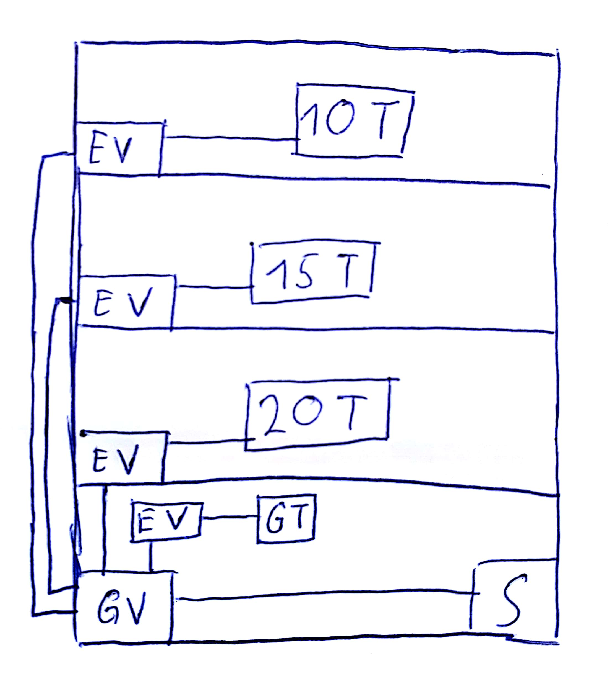

## Klausur
13.10.

Ethernet ist ein Bus System  
MAU == Koppelelement für Ringnetzwerk
#### CSMACD
zufallsbasierter "Priorisierer" in einem nicht-deterministischen Netzwerk

Musterlösung, nicht ganz richtig  
  
Nicht kaskadieren, altes Netz fehlt  

## Subnetting Aufgabe 
### Netzklassen
#### Klasse A
Most Significant Bit 0xxxxxxx  
0-127  
#### Klasse B
Most Significant Bit 10xxxxxx  
128 - 191  
#### Klasse C
Most Significant Bit 110xxxxx  
192 - 223  