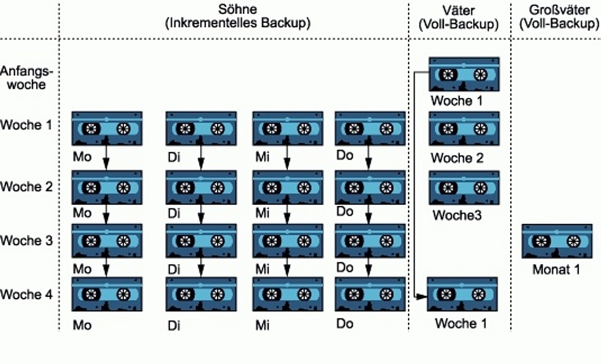

# Datenschutz und Datensicherheit
## Datenschutz
gesetzliche Regelung über die Erhebung, Speicherung und Verarbeitung personenbezogener Daten von 
- Bürgern durch staatliche Stellen
- Arbeitnehmern durch Unternehmen

## Datensicherheit
Schutz von Daten vor:
- Verlust der Verfügbarkeit
- Ausspähung durch nicht autorisierte Personen
- Veränderung
- Fälschung von Indentitätsdeklarationen

=> Durch Vernetzung erhöht sich das Risiko

## Backupverfahren

### Inkrementell
So|Mo|Di|Mi|Do|Fr
---|---|---|---|---|---
FULL|ADD
FULL||ADD
FULL|||ADD
FULL||||ADD
FULL|||||ADD

### Differentiell
So|Mo|Di|Mi|Do|Fr
---|---|---|---|---|---
FULL|ADD
FULL|ADD|ADD
FULL|ADD|ADD|ADD
FULL|ADD|ADD|ADD|ADD
FULL|ADD|ADD|ADD|ADD|ADD

## Generationenprinzip

## Aufgabenblatt Datensicherheit
[Material (todo)]()  

6,2 GB * 1024 MB/GB = 6348,8  
6348,8 MB / 3 MB/s = 2116,3  sek  
2116,3 / 60 sek/min = 35,2711 Min ~ 25 Min 16 Sek  

Wochentag|Datenmenge|Dauer in Sekunden
---|---|---
Sonntag|6200|2116,27
Montag||4,2
Dienstag||8,4
Mittwoch||12,6
Donnerstag||16,8
Freitag||21,0
Samstag||25,4
-|Sekunden/Woche|2204,67
-|Stunden:Minuten:Sekunden/Woche|36m:40s *

Wochentag|Datenmenge|Dauer in Sekunden
---|---|---
Sonntag|6200|2116,27
Montag||4,2
Dienstag||4,2
Mittwoch||4,2
Donnerstag||4,2
Freitag||4,2
Samstag||4,2
-|Sekunden/Woche|2140,27
-|Stunden:Minuten:Sekunden/Woche|