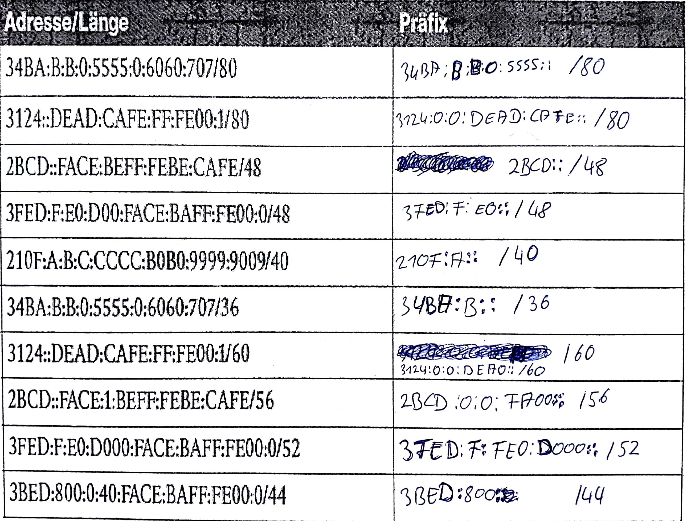
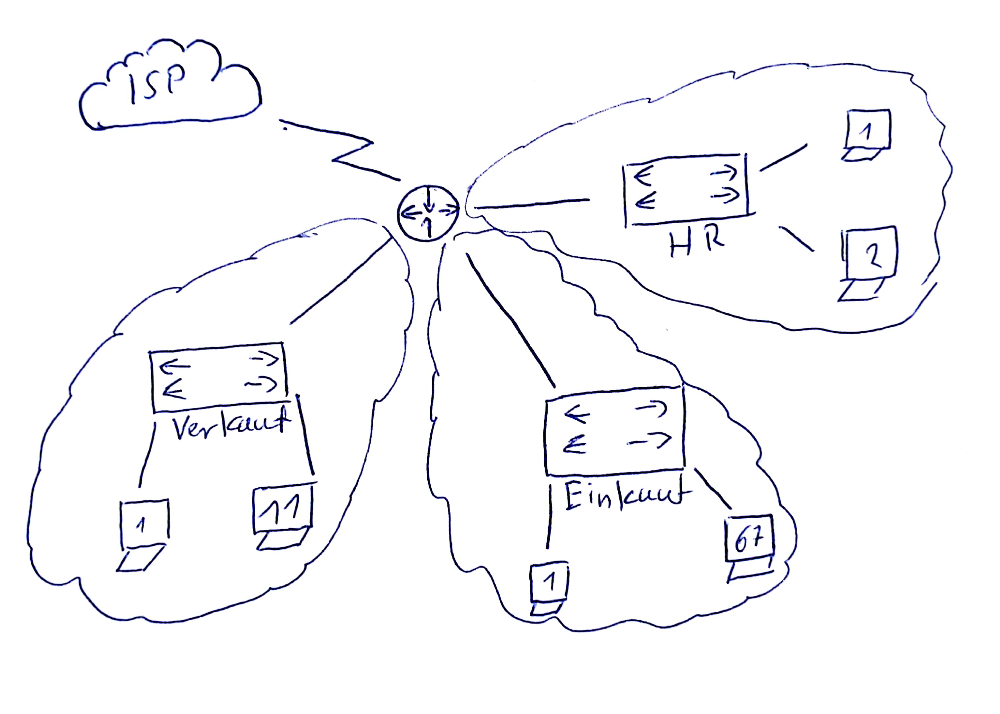

# IPv6
## Substitutionen und Verkürzungen
netzanteil == subnetzpräfix  
hostanteil == interface ID
#### Hausaufgabe


## Aufgabe 7
>In welchem Subnetz befindet sich der Host mit der IPv6-Adresse 2001:0db8:85a3:08d3:1319:8a2e:0370:7344/64?  

2001:db8:85a3:8d3:: ist das Subnetpräfix.  

## Aufgabe 8
>Befindet sich der Host mit der IPv6-Adresse 2001:0db8:85a3:08d3:1319:8a2e:0370:7344/64 im Subnetz 2001:0db8:85a3::/48 ?

Ja die ersten 48 Bits sind gleich.

### Segmentierung
>Jeder Routerport eine Broadcastadresse
- Administration
- Wartbarkeit
- Performance
- Sicherheit

## Aufgabe 9
>Der ISP hat der Service AG einen IPv6 Adressbereich mit der Netzmaske /56 zugewiesen. Erläutern Sie unter Angabe des Rechenwegs, wie viele Subnetze gebildet werden können, wenn der Hostanteil 64 Bit beträgt!  

Gesamte Adresslänge `128`  
Zugewiesener Netzanteil `56`  
Interface ID `64`  

```math
128-56-64 = 8 => 2⁸ = 256
``` 
Antwort: 256 Subnetze

### Link Local
`SLAAC` == Stateless Address Auto Configurator  
wichtiges Feature von IPv6 für die Kommunikation im LAN  
=> Kein DHCP erforderlich  
- für die Umsetzung wird der link-local Bereich fe80:: genutzt!  

IPv6 Clients besitzen meist zwei Adressen:  
eine link local Adresse  
und eine global Unicast Adresse (2001::)  

link local per Autoconfiguration (interface ID)  
MAC Adresse/aufblasen/invertieren  
-> EUI-64 Verfahren


## Aufgabe Tafel
Ihnen wird vom ISP die Adresse 2001:dead:beef::/48 zugewiesen. Dokumentieren sie die logische Adressierung die die Vorteile der Segmentierung ermöglicht.  


```
ISP Block: 2001:dead:beef::/48    
Netz 1: 2001:dead:beef:4000::/52  
Netz 2: 2001:dead:beef:8000::/52  
Netz 3: 2001:dead:beef:c000::/52
```
oder auch:   
-> /64
```
2001:dead:beef:1::/64
2001:dead:beef:2::/64
2001:dead:beef:3::/64
```