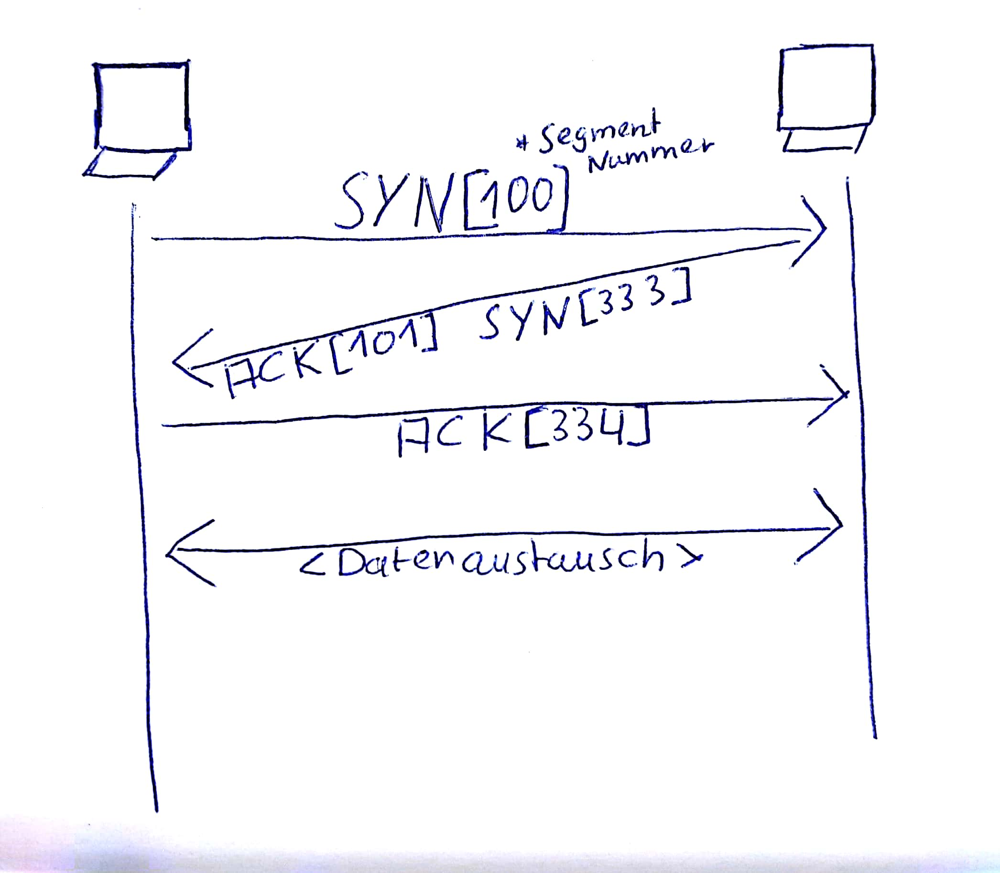
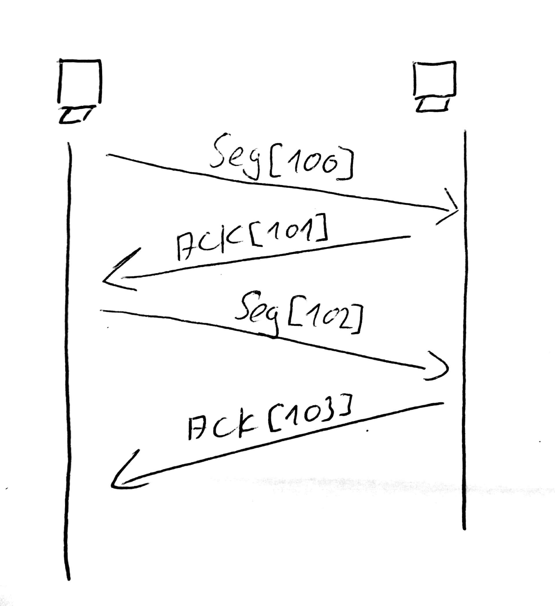

# Handshake
>Verbindungsaufbau  
{width=300px}  

>Datenaustausch mit Window Size == 1  
{width=300px}  
 
#### Sliding Window  
- mehrere Segmente werden verschickt ohne auf Bestätigung zu warten
- Window Size == Anzahl der Pakete
- >bei Empfangsproblemen wird Window Size angepasst

## TCP
- **T**ransmission **C**ontrol **P**rotocoll  
- verbindungsorientiere Kommunikation  
- verläßliche Kommunikation  
  - `ACK`  
- Flusssteuerung   
  - Sliding Window
- Bsp. `HTTP` / `FTP` / `telnet`

## UDP
- geringer Overhead
- schnell
- >Video/Audio Stream
- Bsp. `TFTP` / `DHCP`
