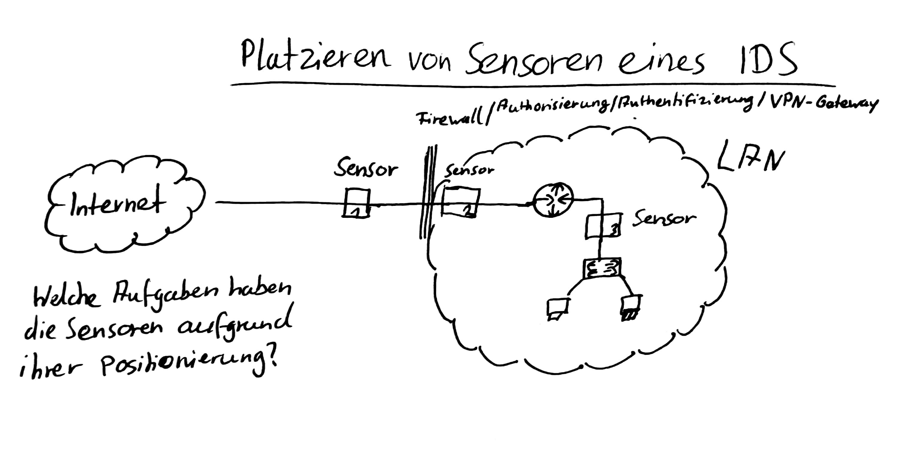

# IDS/IPS
## Definition
**I**ntrusion **D**etection **S**ystem  
**I**ntrusion **P**revention **S**ystem  

## Aufgaben IDS
Angriffserkennung  
Missbrauchserkennung  
Anomalieerkennung  

## HIDS
Hostbased IDS  

Installation pro Host  
Prüfung von Systemdaten, braucht Kernelzugriff  

Integritätstest  
Snapshots  

System Integrity Verifier  
File Integrity Assessment  

## NIDS
networkbased IDS  
Überwachung von Netzverkehr  
Angriffe von außen  
Paketanalyse  

## HIDS vs NIDS
### Vorteile HIDS
- lokales erkennbar
#### Nachteile HIDS 
- keine netzwerksachen erkennbar
- aufwändig

### Vorteile NIDS
- mehrere hosts angegriffen
- missbrauch netzwerkresourcen
### Nachteile NIDS 
- Bandbreite
- verschlüsseltes nicht erkennbar

## Sensoren

### Sensor 1
unauthorisiierte Zugriffe
### Sensor 2
alles was durch den Router gekommen ist
### Sensor 3
interner Verkehr

[CT Cloud](./Material/20171213_CT_Cloud.pdf)  
