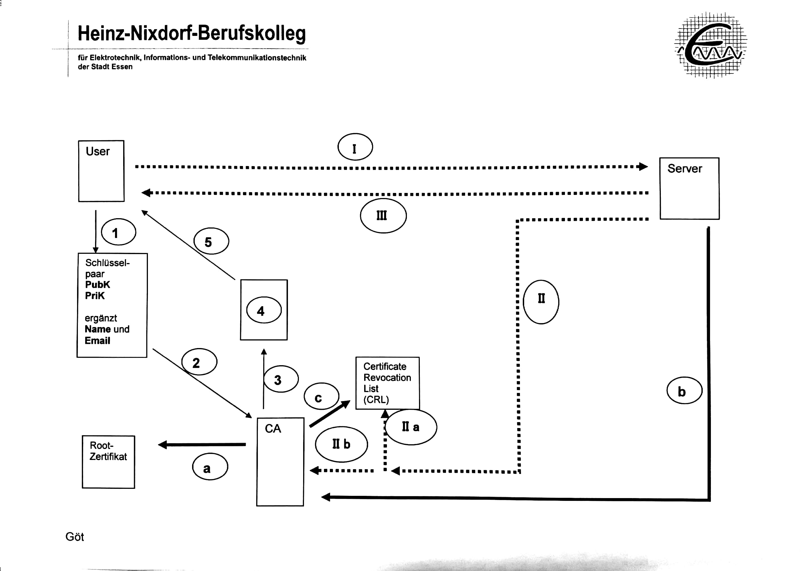
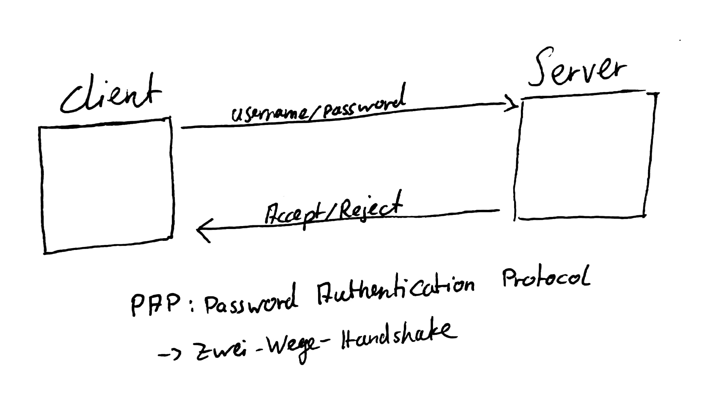
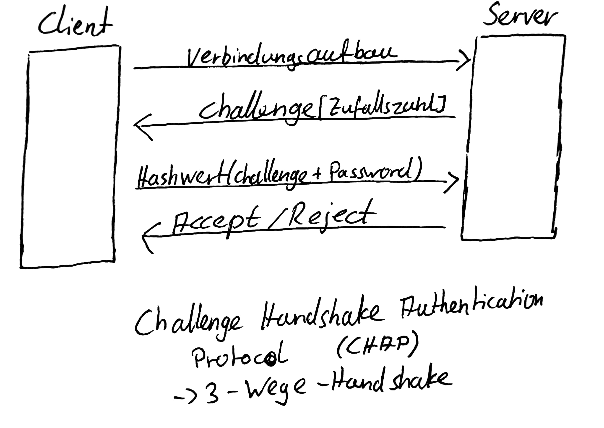

## Zwei Faktor Authentifizierung
- besitz (biometrisch)
- wissen
- > Zuwachs an Sicherheit

### Welche Anteile der Kommunikation müssen verschlüsselt erfolgen?
- keine, nicht zwingend notwendig

### Vier Elemente die für ein Zertifikat von höchster Bedeutung sind.
- Fingerabdruck
- Gültigkeit
- Aussteller
- ausgestellt für
- Public Key
### PAP
 
`Password Authentication Protocol`  
Zwei Wege Handshake  
### CHAP
  
`Challenge Handshake Authentication Protocol`  
Drei Wege Handshake  
### MS CHAP
- gegenseitige Authentifizierung
- > vermeidet MitM Attacke

## Sicherheit und AAA
[Material](./Material/20180201_Sicherheit_und_AAA.pdf)

### IEEE 802.1x
IEEE 802.1X ist ein Standard zur Authentifizierung in Rechnernetzen.  
Schlägt EAP als Authentifizierungsverfahren vor.  

### EAP
#### Identität
Eingabe einer User ID, Request Paket kann Aufforderungstext enthalten
#### Benachrichtigung
Im Datenteil des Pakets wird eine Meldung an den User transportiert.
#### One Time Password
Request enthält OTP Challenge, Response enthält OTP
#### MD5 Challenge
=~ CHAP mit MD5.  
IM Request wird ein Zufallswert übertragen. Response enthält Hash Wert über Zufallswert und ein Passwort das beiden Seiten bekannt ist.
#### NAK
No Acknowledgment.  
Darf nur in Response Nachricht übertragen werden. Peer unterstützt Auth Verfahren nicht.

### Besonders sicheres EAP aktuell

