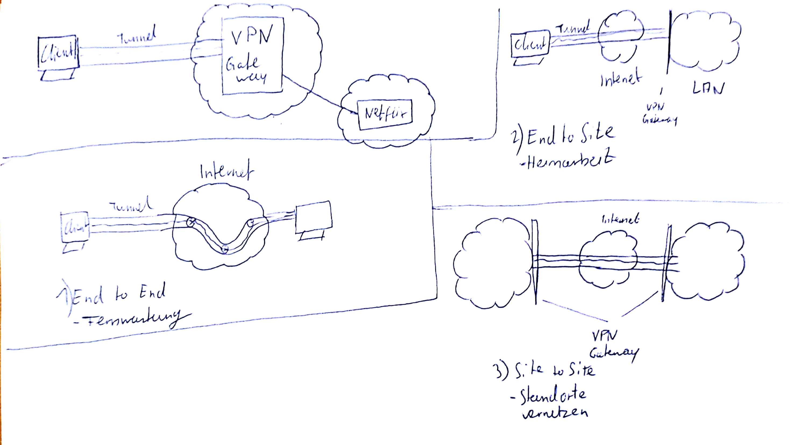
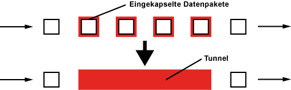

## VPN
Virtual Private Network  
#### Schlagwort
- Tunnel
- Anonymität
- Lokalisierung
- Sicherheit
- Vertraulichkeit
- Integrität
- Authentifizierung

### Typen

### Was ist ein Tunnel? (VPN Kommunikation)
  

IP Pakete werden zwischen mit zusätzlichen VPN Headern gekapselt.  
Verschlüsselte Verbindung zum VPN Server, Anfragen werden weitergereicht, Angefragter Server kann nicht die "echte IP" sehen, sondern nur die IP des Gateways.

> Logische Verbindung zwischen zwei Endpunkten durch zusätzliches Transportprotokoll
### Topologie (3 Arten) --> Einsatzzwecke
- End-to-Site-VPN
    - (Host-to-Gateway-VPN / Remote-Access-VPN)
- Site-to-Site-VPN 
    - (LAN-to-LAN-VPN / Gateway-to-Gateway-VPN / Branch-Office-VPN)
- End-to-End-VPN 
    - (Host-to-Host-VPN / Remote-Desktop-VPN)

### Protokolle?
- IPsec
- PPTP
- L2TP
- L2TP over IPsec
- SSL-VPN
- Hamachi
- OpenVPN (Software, kein Protokoll)

### VPN Protokolle

Tunnel Protokoll|OSI Layer|tunnelbare Protokolle|Geräte /Paket Auth.|Benutzer auth.|Crypto|Schlüssel mgmt.|QoS|Ende-zu-Ende Security|IP Tunneling|Hauptanwendung
---|---|---|---|---|---|---|---|---|---|---
PPTP|2||Nein|Ja|RC4|Nein|Nein|Ja|Ja|E2E
IPSEC|3|TCP/IP|Ja|Ja|AES|Ja|Ja|Ja|Ja|E2E
L2TP|2||Nein|Ja|-|Nein|Nein|Nein|Ja|Tunnelaufbau, Kombi mit IPSec
SSL|4-7|HTTP, FTP, IMAP|||||||Ja|Web Anwendungen / Alles ohne NAT
