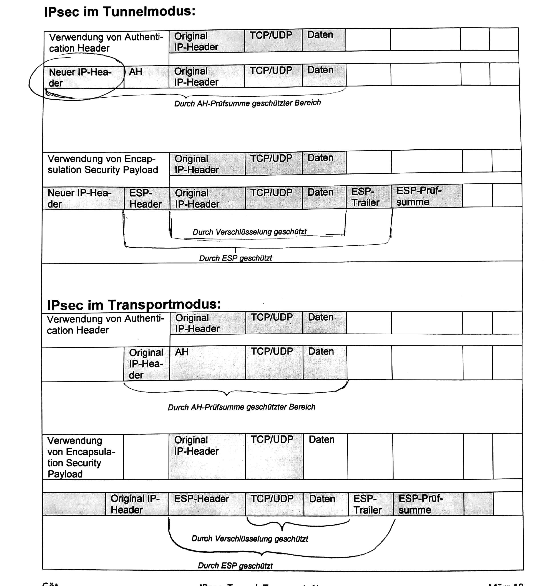

## IPSec - Tunnel & Transport
[VPN Knigge](./Material/20180315_vpn_knigge.pdf)   
[IPSec](./Material/20180315_ipsec.pdf)  
#### Beschreiben sie den Unterschied zwischen Tunnel und Transportmodus

#### Erläutern sie den Unterschied zwischen AH und ESP
- AH
    - Authentifizierung, Integrität
- ESP
    - Vertraulichkeit
#### Kennzeichnen sie jeweils den durch AH bzw. ESP geschützten Bereich

#### In welcher Umgebung bietet der Tunnelmodus keinen wesentlichen Sicherheitszuwachs
- im LAN

- keine Identifizierung der Endpunkte
- RSA/PSK
[Präsentation IPSec](./Material/20180315_VPN.pptx)