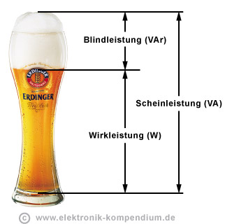

# Tunnelprotokolle
## IPSec
"Standard" für gewerbliche Nutzung 
- proprietäre Nutzung
- Problem NAT
- Layer 3
## SSTP 
Ablösung für PPTP
- Layer 2
## PPTP
RC4 als Verschlüsselungsalgorithmus
- Keine Empfehlung
- Layer 2
## L2TP
Layer 2 Tunneling Protocoll 
- Tunnelaufbau, Authentifizierung 
- Keine Verschlüsselung
## IKE
Internet Key Exchange 
- Unterstandard von IPSec
- Layer 3

# PoE
## Definition
Versorgung von Verbrauchern über ein Ethernet Kabel.
## Beispiele 
Access Point, Telefon, Überwachungskamera
#### Spannung
48V

### Exkurs Elektrotechnik
#### Formeln
P = U * I   
P = Watt  
U = Volt    
I = Ampere    

U = R * I  
R = U / I  
I = U / R  

E = P * t Arbeit  
E = Wh  
W = Wh  

`Eine Grafikkarte braucht 95 Watt, läuft immer. Stromkosten/Jahr berechnen.`
`95W*24h*365t*0,3€/kWh`

### Wirk- Schein- und Blindleistung

