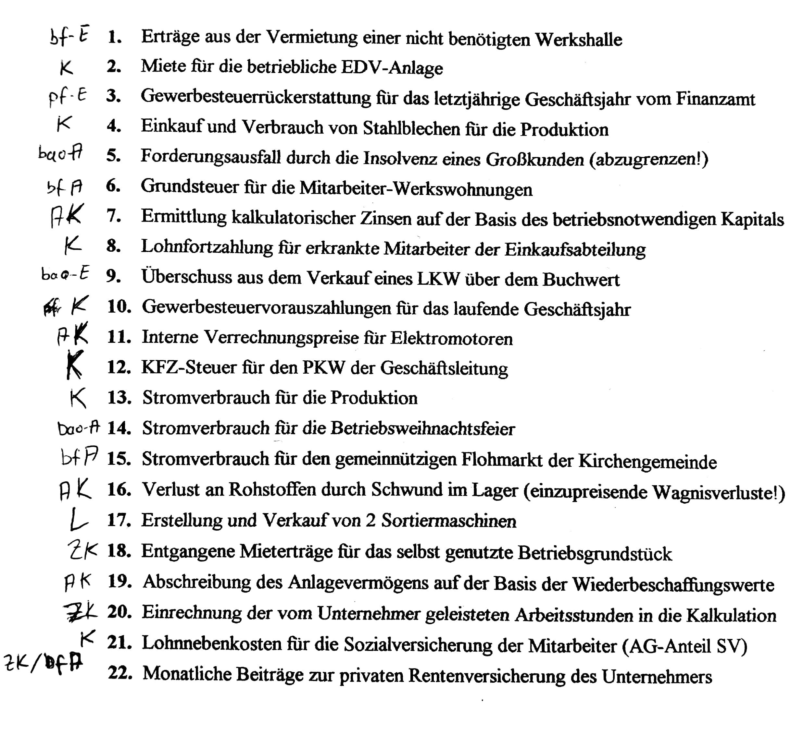

# Interne Kosten und Leistungsrechnung
bb = betriebsbedingt  
bf = betriebsfremd  
pf = periodenfremd  
bao = betrieblich außerordentlich  

## nicht berücksichtigt
periodenfremde  
betriebsfremde  
betrieblich außerordentlich  

## Materialien
[KuL2](./Material/20171016_KuL2.pdf)  
[KuL3](./Material/2017_10_16_KuL3.pdf)  
[Kostenarten](./Material/2017_10_16_Kostenarten.pdf)  

## Lösung Kostenarten

## Kostenstellen und Kostenträger Rechnung
[Material](./Material/2017_10_16_Kostenstellen&Traeger.pdf)

## Kalkulationszuschläge
[Material](./Material/2017_10_16_Kalkulationszuschlaege.pdf)

### Berechnung der Gemeinkostenzuschläge
MGKZ == (32.090*100)/450.000

FGKZS == (137.490*100)/120.000

VWGKZS == (52.440*100)/Herstellkosten

VTGKZS == (28.210*100)/Herstellkosten