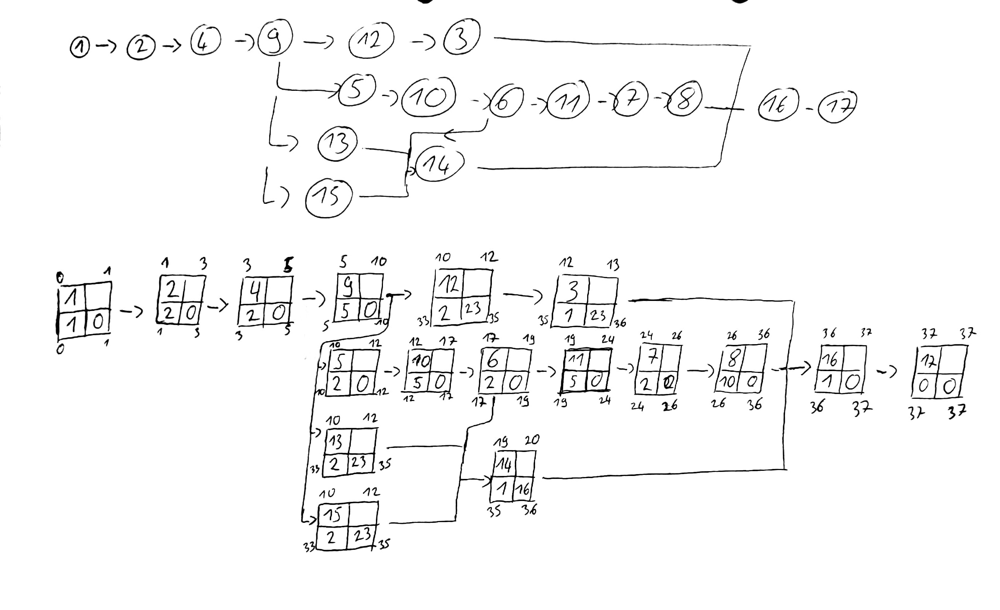

# Netzplantechnik
[Material Netzplan](./Material/20171211_Netzplan_mit_Aufgabe.pdf)

0. Skizze
    - Um Überschneidungen zu erkennen und zu eliminieren
1. 
    1. Reinzeichnung
        - Übernahme der Skizze mit Formvorschrift  
    2. Vorwärtsrechnung
        - Prämisse:  
        ```
            FAZ Start = 0  
            FEZi = FAZi + di  
            FAZj = MaxFEZi  
        ```
    3. Rückwärtsrechnung
        - Prämisse:  
        ```
            FEZ Ende = SEZ Ende  
            SAZj = SEZj - dj  
            SEZi = Min SAZj  
        ```
    4. Puffer
        - Prämisse:
        ```
            GP = SEZi - FEZi  
            oder  
            SAZi - FAZi  
        ```
    5. Kritischer Pfad  
        - Verbindung aller Vorgänge mit GP = 0 

[Tafelbild](./Material/20171205_Netzplantafelbild.pdf)  
#### Aufgabe aus dem Material

### Klausur 12.12.
- Projektinitiierung
    - Beteiligte
    - Anlässe
    - Benchmarking
    - Mängelquantifizierung
    - Positive / Negative Problemerkennung
    - Ziele (Bez./SMART)
    - Risiken
    - Projektauftrag-inhalt
- Planung
    - PSP als Baum
    - GANNT
    - Netzplan (Skizze/Rechnung)
