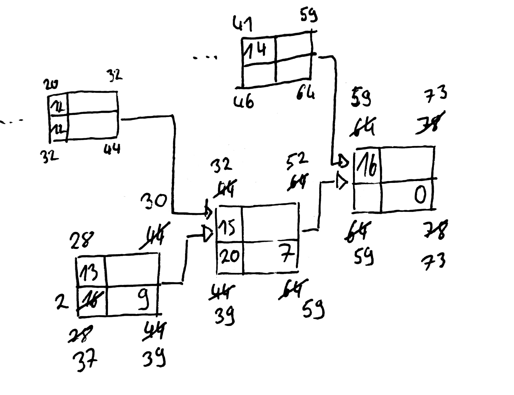

## Mängelquantifizierung
- Überlange Bearbeitungsdauer
- Mangelhafte Qualität Endprodukt
- "viele Tickets" 

Fehlergrund|Referenzgröße|Fehlerhäufigkeit|Prozent
---|---|---|---
Überlange Bearbeitungszeit|2000|100|5%
Mangelhafte Qualität|2000|1000|50%
viele Tickets|2000|200|10%

# Netzpläne
[Material](./Material/20180130_handlungssituation.pdf)

Nr.|Art|Zeitliche Änderung|Auswirkung GP|Auswirkung Projektende|Anmerkung
---|---|---|---|---|---|---
1|kritischer Vorgang|Verzögerung (4 Tage)|-|Verzögerung um 4 Tage|
13|kritischer Vorgang|Beschleunigung (14 Tage)|steigt|Beschleunigung|siehe [Bild 1](#bild-1)
11|nicht kritisch|Verzögerung (5 Tage)|Sinkt auf 0|-
10|nicht kritisch|Beschleunigung (1 Tag)|steigt|-
14|nicht kritisch|Verzögerung (6 Tage)|sinkt auf 0|Verzögerung um 1 Tag
5|nicht kritisch|Verzögerung (5 Tage)|sinkt|-

##### Bild 1

## COCOMO
#### Definieren sie Personenmonat
Die Summe an Stunden, die eine Person in einem Monat, mit 8 Stunden Arbeit am Tag erreichen kann.

#### Benennen sie ein Beispiel dafür , dass man nicht einfach, die Personenmonate durch eine beliebige Anzahl von Personen teilen kann, um die Projektdauer zu ermitteln.
Ein Baby kann nicht durch 9 Frauen in einem Monat zur Welt gebracht werden.

#### Führen sie eine Aufwands- und Dauerschätzung nach dem COCOMO Basismodell für ein organisches Projekt mit ca. 30 KDSI durch.
#### Benennen sie konkrete Kostentreiberfaktoren.