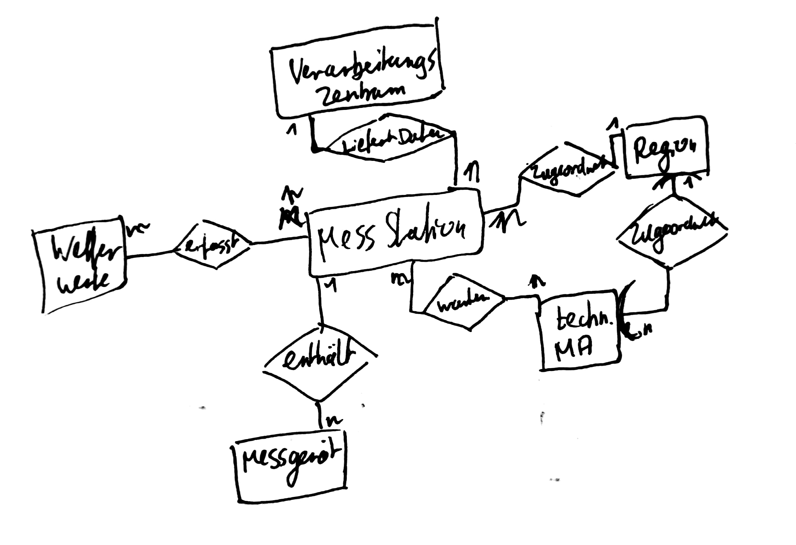

## a

## ba
Datenredundanz beschreibt den Umstand, dass Informationen an mehreren Stellen in einer Datenbank gespeichert sind.  
Dies ist zu vermeiden, da so Änderungen an einem Datensatz an mehreren Stellen erneut ausgeführt werden müssen um inkonsistente Datenbestände zu vermeiden.
## bb
Normalisierung beschreibt das Vorgehen das dazu führt, dass Datenfelder mit möglichst atomaren Werten gefüllt sind.  
Ist eine Information in mehrere "Unterinformationen" aufteilbar sollte dies geschehen
## bc
Ein Primärschlüssel ist eine Untermenge an Attributen der ausreichend einzigartig ist um einen Datensatz in einer Tabelle von einem anderen zu unterscheiden.
